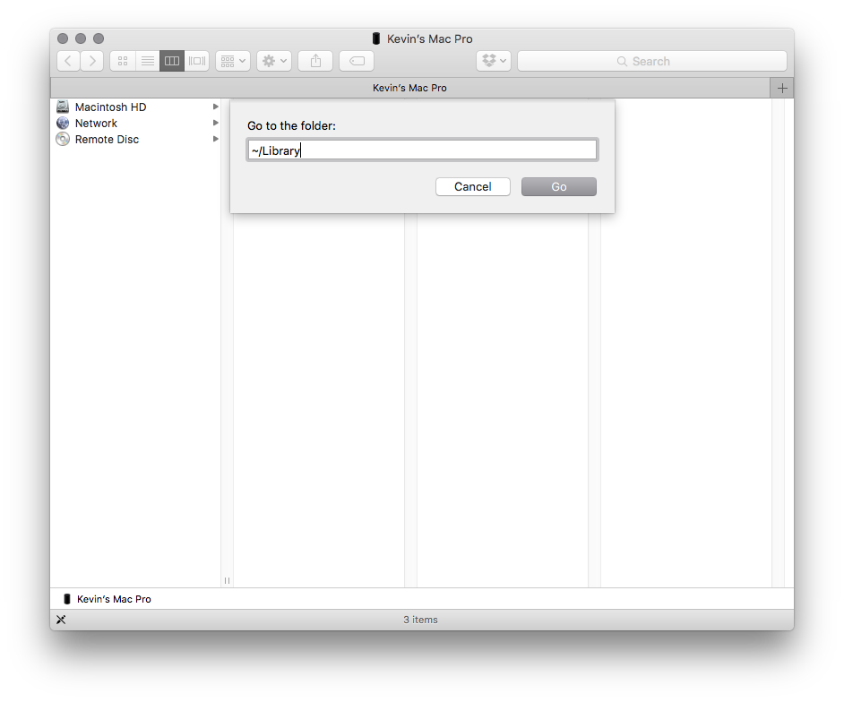
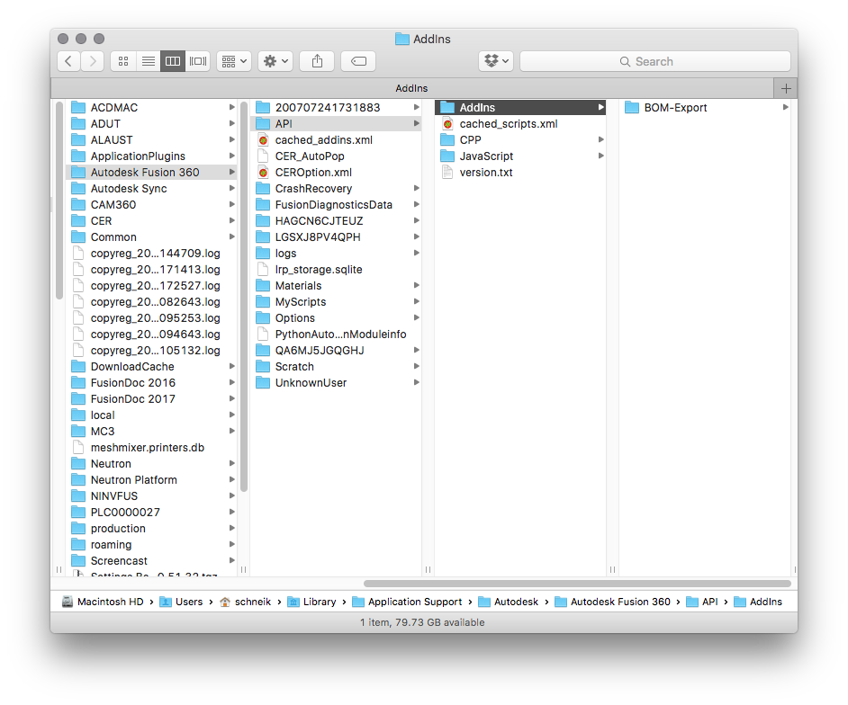
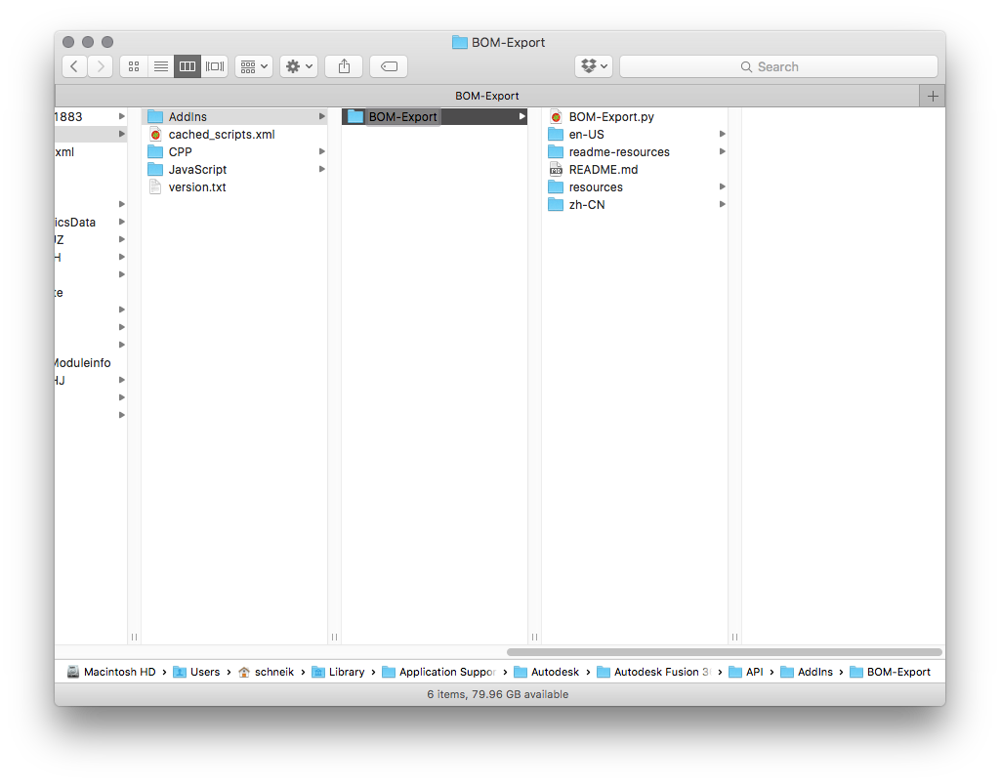
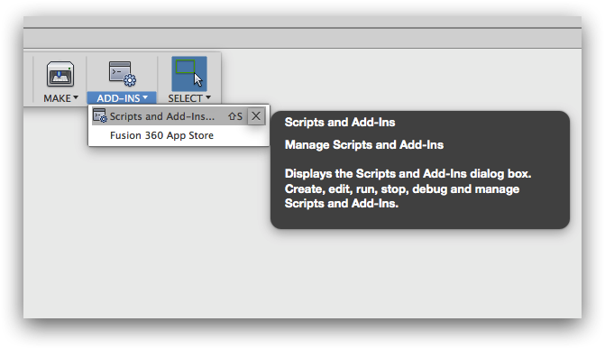
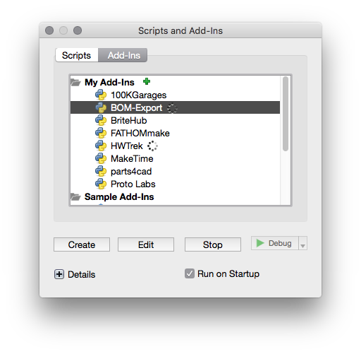
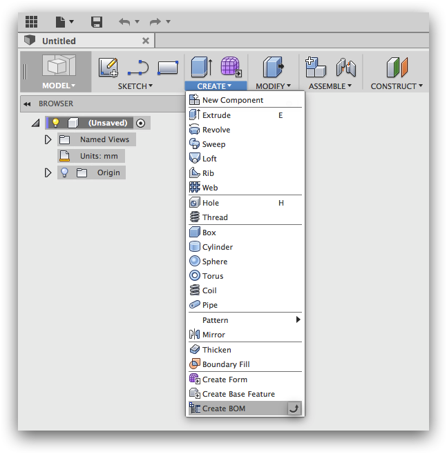

# BOM-Export
This addin allows you to export an open assembly to a CSV file so you can manage or import your parts information into other tools or services.

BOM export is a work in progress and as such is not complete. It does, ghowever, fill an important need in its curent state. 

BOM Export supports:

* Flat list of all parts, all levels in the open assembly  
* Removal of sub assemblies so as to create a list of all parts only  
* Part properties as columns  
	* Counts of components: parts and sub assemblies  
	* Component display name as show in browser, including option to supress version number for refrenced designs  
	* Component Description  
	* Components Material. If a components has multiple materials on different bodies, multiple materials will be listed  

##Instalation

###Mac OS
1. Download the main GIT repo [Here.](https://github.com/schneik80/BOM-Export/archive/master.zip)  
2. Extract the zip archive to a convient location.
3. Open a finder window and in the menu bar select **Go to Folder...** Enter "**~/Library**"

4. Browse to **~/Library/Application Support/Autodesk/Autodesk Fusion 360/API/Addins**.

5. Copy the **BOM-Export** folder you extracted in step 2 into the **Addins Folder**.
  
6. Next, Launch Fusion 360
7. In the Addins-Pane on the Toolbar select **Scripts and Add-ins...** or press **Shift + S**  
  
8. Switch to the **Add-Ins** Tab. You should see BOM-Export in the list.
  
9. Select the **BOM-Export** item in the list and press **Run** and check **Run on startup**. This will ensure that the add-in is always available. You should see BOM-Export now has a running spinner.
    
10. To confirm that the add-in is available. Close the Add in dialog and look at the bottom of the **Create-Pane**
  

